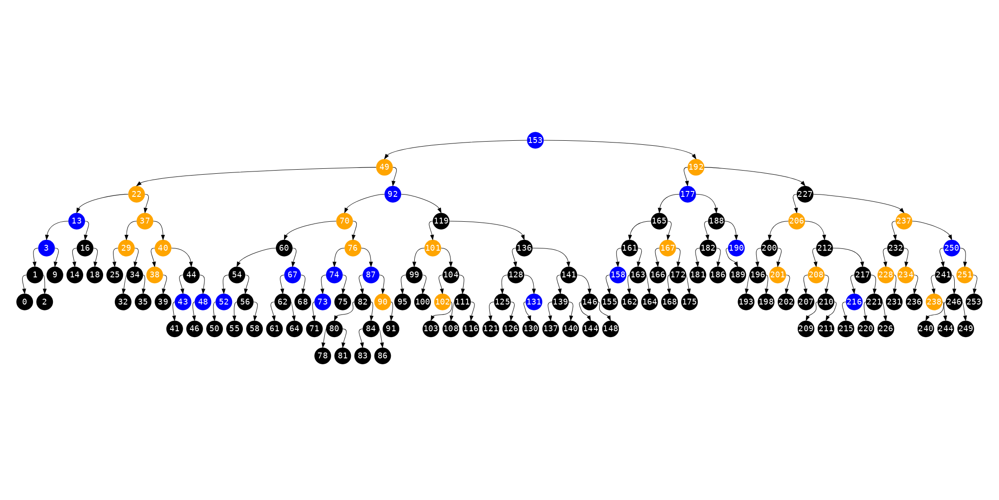

# Cavl

Generic single-file implementation of AVL tree suitable for deeply embedded systems.
**Simply copy `cavl.h` or `cavl.hpp` (depending on which language you need) into your project tree
and you are ready to roll.**
The usage instructions are provided in the comments.
The code is fully covered by manual and randomized tests with full state space exploration.

For development-related instructions please refer to the CI configuration files.
To release a new version, simply create a new tag.

